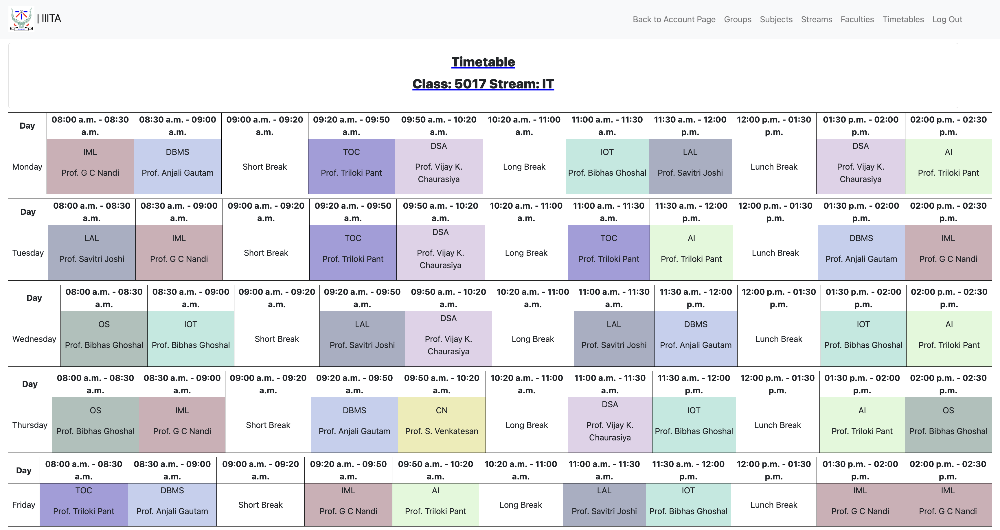
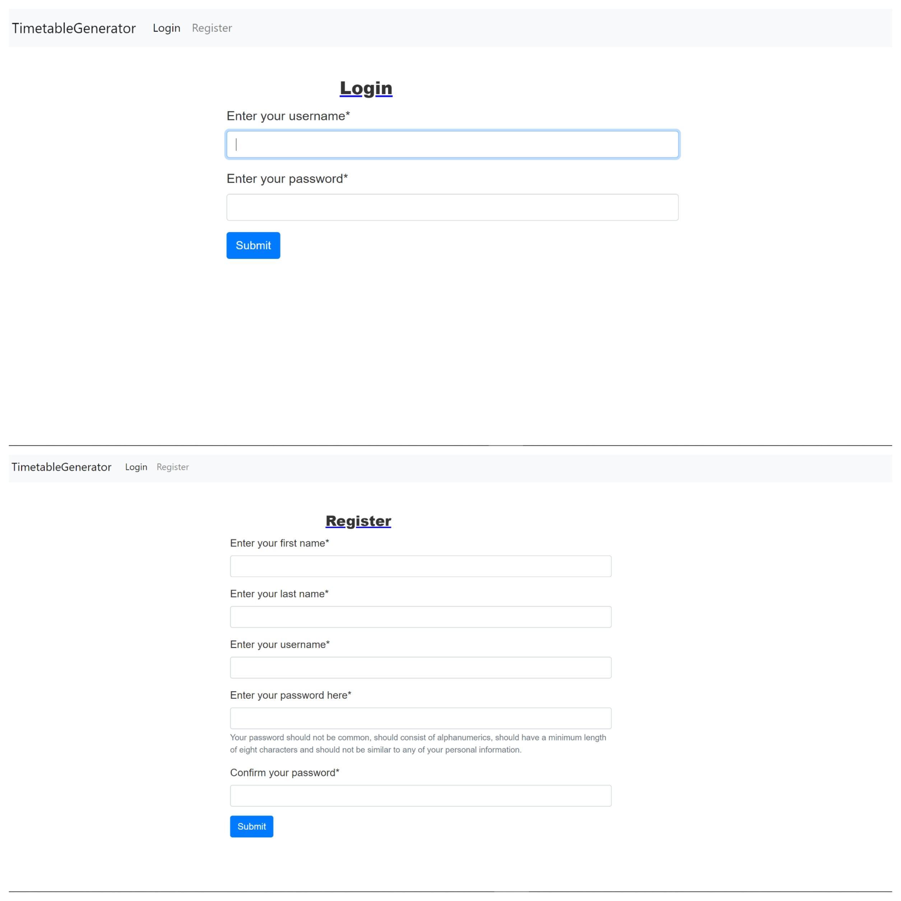
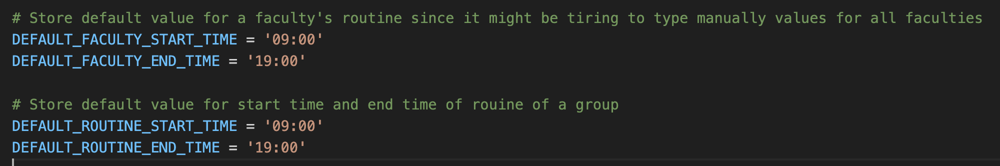
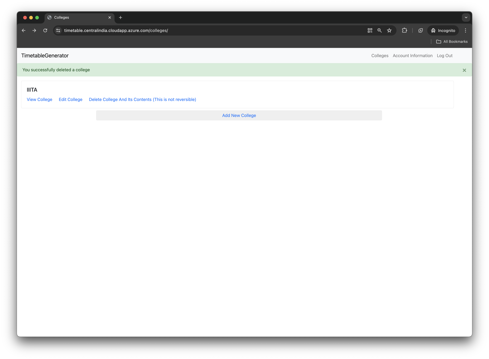
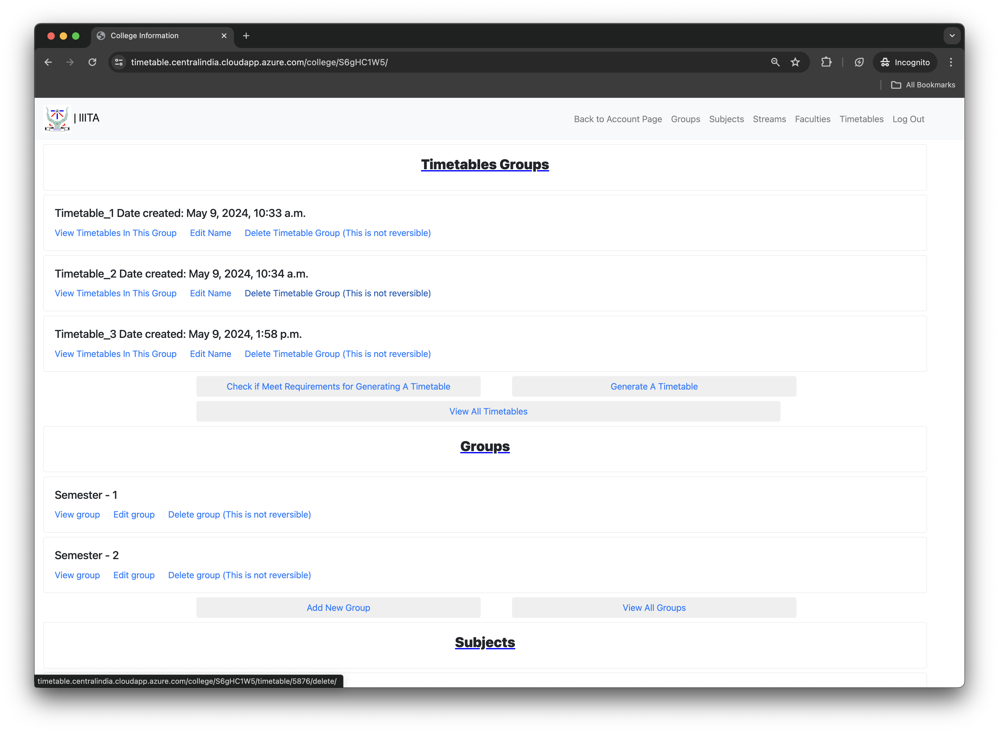
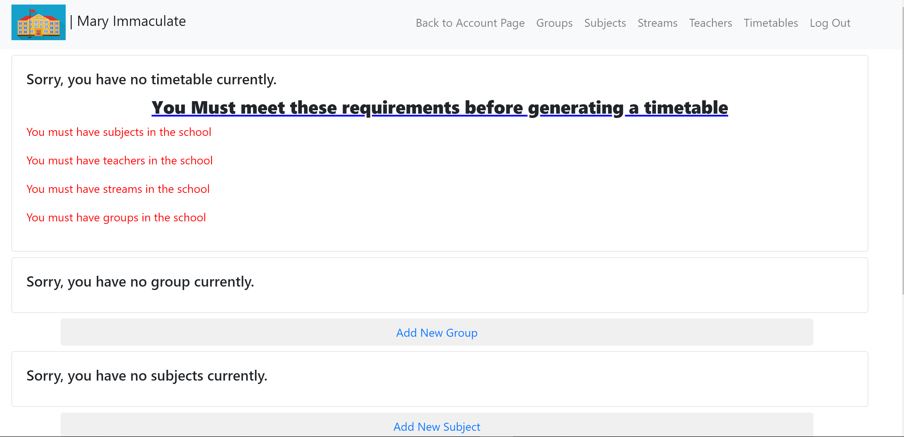
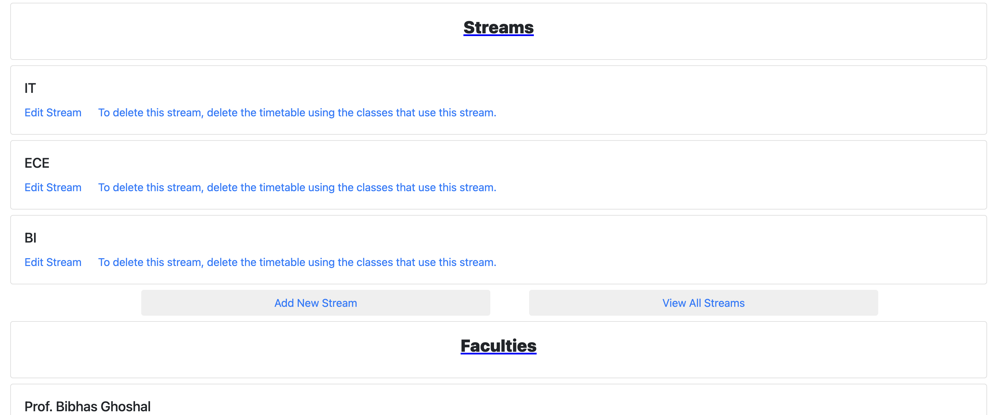
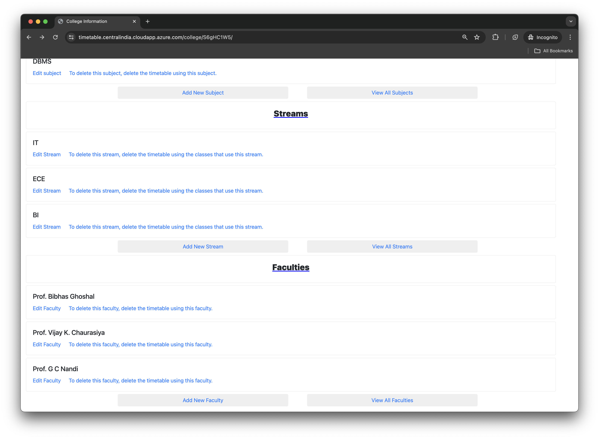
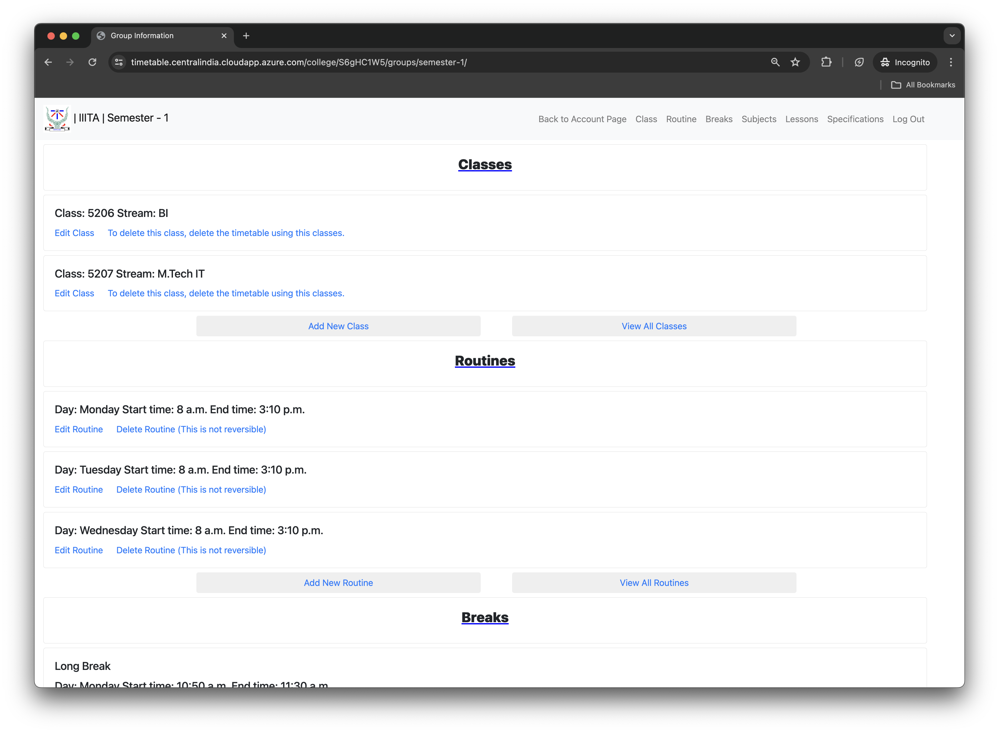
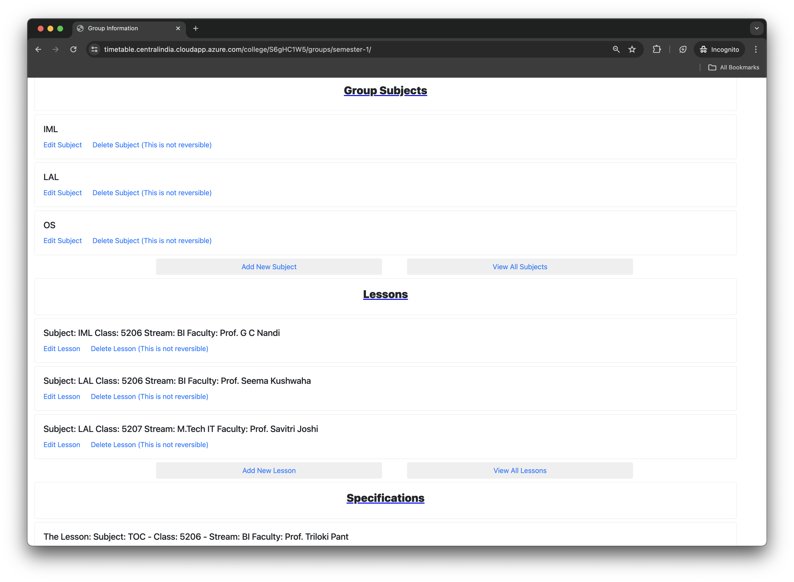

# CollegeTimeTableMaker

> This is a django project used to generate timetables for a college which could be output as a pdf and downloaded.

# Requirements  (Prerequisites)
Tools and packages required to successfully install this project.
For example:
* Python 3.10.4 and up [Install](https://www.python.org/downloads/)

# Installation
Clone this project in your local machine. Crete a virtual enviroment and enter it.

Run the following command in the virtual environment to install all requirements of this project.

`pip install -r requirements.txt`

Create a `.env` file in your projects root folder.

    SECRET_KEY = YOUR_SECRET_KEY
    DEBUG = A boolean value
    ALLOWED_HOSTS= A list of comma separated hosts to allow.

Ensure you are in the project's root folder when you run the following command.

`python manage.py runserver`

Navigate to :

`127.0.0.1:8000/login`

* There are two accounts present in the database.

    * An account with admin priviledges and can access `127.0.0.1:8000/admin/`
        
        * Username - user
        * Password - user123.
    * An account with no admin priviledges(The account that contains the sample data)

        * Username - test
        * Password - test123.

In case you want to create an administator account, run the following command in your terminal and filll the requested information. 

* `python manage.py createsuperuser`

* Afterwards, navigate to `127.0.0.1:8000/admin/` to the User model and add a randomid for the newly created super user. (A randomid is a unique randomly generated string which contains eight characters which are a mixture of letters and nummbers). Since by default , Django does not generate one.

In case you want a normal account with no admin priviledges, navigate to `127.0.0.1:8000/register/` and fill the form.

You may want to modify the values for the last four variables in your settings.py. Thepurpose of the four variables is to reduce the strain of typing values manuaaly which may otherwise be redundant in your college.

* DEFAULT_FACULTY_START_TIME - Specifies the default start time to use for every faculty's routine as you render the form in your browser.
* DEFAULT_FACULTY_END_TIME - Specifies the default end time to use for every faculty's routine as you render the form in your browser.
* DEFAULT_ROUTINE_START_TIME - Specifies the default start time to use for every group's routine as you render the form in your browser.
* DEFAULT_ROUTINE_END_TIME - Specifies the default end time to use for every group's routine as you render the form in your browser.

# Screenshots
Here are some of the screenshots of the application.

# Features
- Lesson specification at a particular time.
- Generate random colors for a given subject for a college for visual appeal as one generates a timetable.
- Accommodate all days of the week to fit any college's routine.
- Specify the routine of a particular faculty to generate a timetable fitting his/her schedule.
- Check if a college can generate its own timetable and reports on its errors in case of any.
- Flexibility - One can specify how long a given group of a college should start or stop their daily sessions.

# Usage example

- Register for an account/ Log in if you already have an account.
- Create a college. (A college logo is optional and the college name you enter should be unique in your account).
    > When you view a college, you should see what you need to add first before generating a timetable.

    

    - Add subjects in your college. The subject name you enter should be unique for your college.  You can only delete a subject, if you delete the timetable using that subject. However, you can edit the subject's details.
    - Add streams in your college. At least all classes in a college should have a stream. The stream name you entered should be unique for that college.  You can only delete a stream, if you delete the class using that stream. However, you can edit the stream's details.
    - Add faculties in your college. As you add a faculty, you should specify for each day, the faculty's routine. You can only delete a faculty, if you delete the timetable using that faculty. However, you can edit the faculty's details.
    - Add groups in your college. A group is where you define the routine, classes, breaks and lessons since a college may have different classes having their own routine.

    ---

    

    

    > When you do all the above steps, the college home page will change as follows. The page will show you, what for each group to generate a timetable

- For each group you have created:

    - Add subjects to the group. The subjects list is from the subjects you have in your college. A subject is only added once in a group.
    - Add classes. A class name of a particular stream only exists once in a given group. A class faculty can only have one class in that group. You can only delete a class, if you delete the timetable using that class. However, you can edit the class's details.
    - Add a routine for all days to include in your timetable with appropriate times. The routine of a particular day is chosen only once in that group.
    - Add lessons in that group. For a given class and a given subject, there is only one faculty. The number of lessons per week should be of good estimates lest you have an error as you generate your timetable.
    - You may add lesson specification if you wish to. The chosen period should be within the routine of a day.
    - You may add breaks for a particular group if you wish to. The chosen period should be within the routine of a given day.

    ---

    

    

- If you have done all the above steps, you may ***check if your college meets the reqirements to generate a timetable*** in the college's homepage.
- If you meet all requirements, you may generate a timetable. Any erros will be reported in case they occur.

# Project Structure

The django project is divide in to four apps.

* frontend - Contain the all the templates used by the project.
* groups - Contain all college groups related information
* colleges - Contin user-related and college-related information.
* timetable - Contain timetable-related information with the algorithims on timetable oprations.

# Built With
1. [Django](https://djangoproject.com/) - The Django framework
